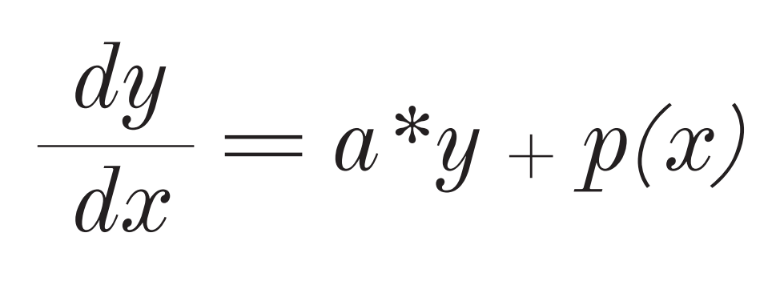

# <em>RungeKutta-4 But in C</em>

<h2><i>Introduction:</i></h2>

Discover the C implementation of the fourth-order Runge-Kutta method, a powerful numerical technique for solving ordinary differential equations (ODEs). This algorithm balances accuracy and efficiency, making it ideal for dynamic system simulations.

We will be rearranging our equation, storing its coefficients and determining its polynomial's degree in order to solve the <strong>ODE.</strong>

Our equation look klike this:

