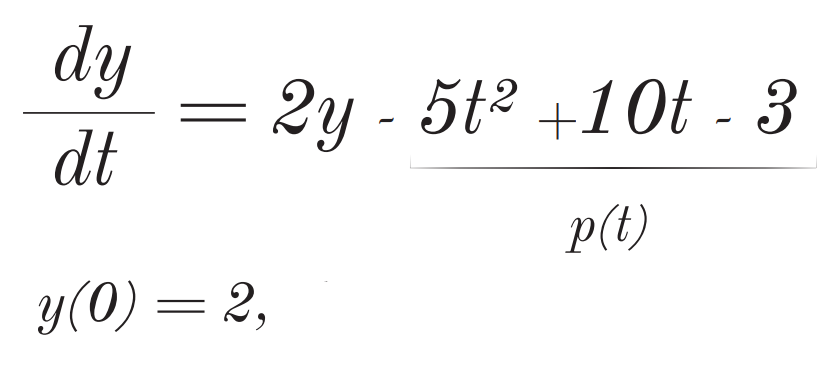

# <em>RungeKutta-4 But in C</em>

<h2><i>Introduction:</i></h2>

Discover the C implementation of the fourth-order Runge-Kutta method, a powerful numerical technique for solving ordinary differential equations (ODEs). This algorithm balances accuracy and efficiency, making it ideal for dynamic system simulations.

We will be rearranging our equation, storing its coefficients and determining its polynomial's degree in order to solve the <strong>ODE.</strong>

### Our equation should look like this:

In this context, <i>'a'</i> serves as a coefficient, and <i>p(x)</i> represents a polynomial. Our focus lies on the fundamental attributes of polynomials, primarily the <em><strong>Polynomial Degree</strong> and the <strong>Constant term.</strong><em> At this juncture, we are working with straightforward equations, devoid of complexity.
 
  
### Example:

